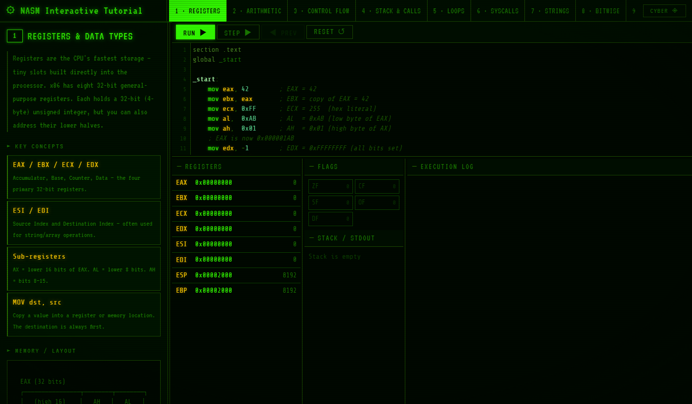
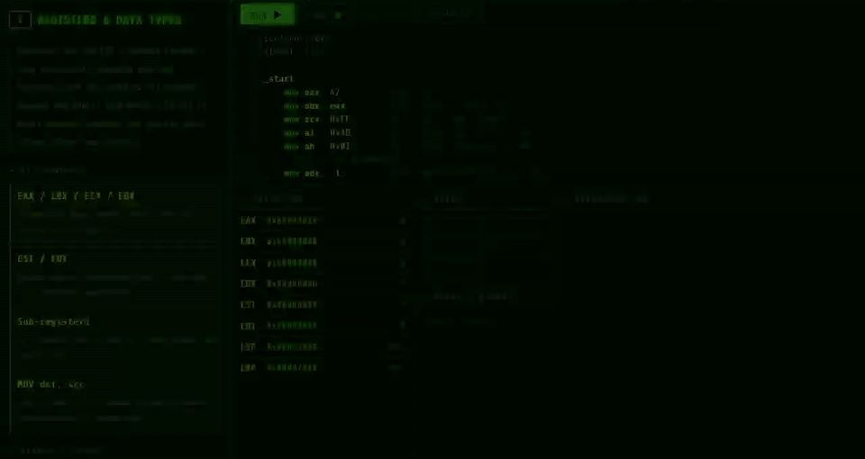
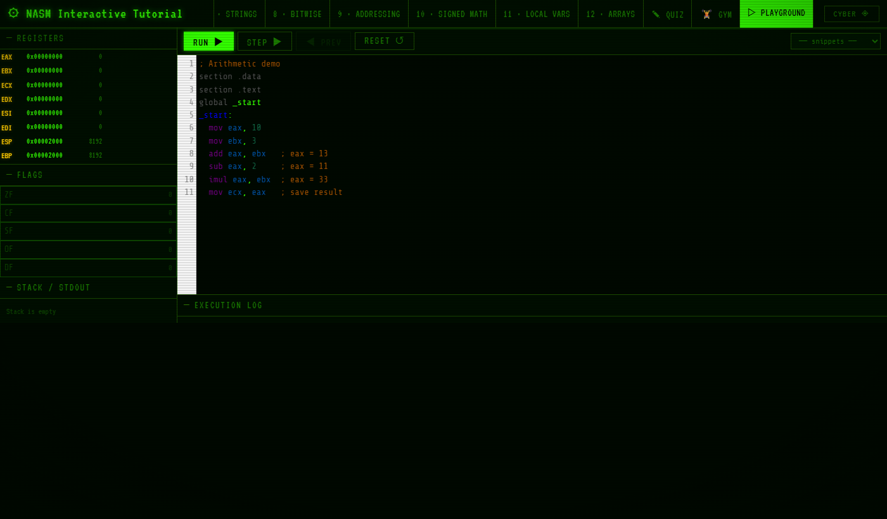
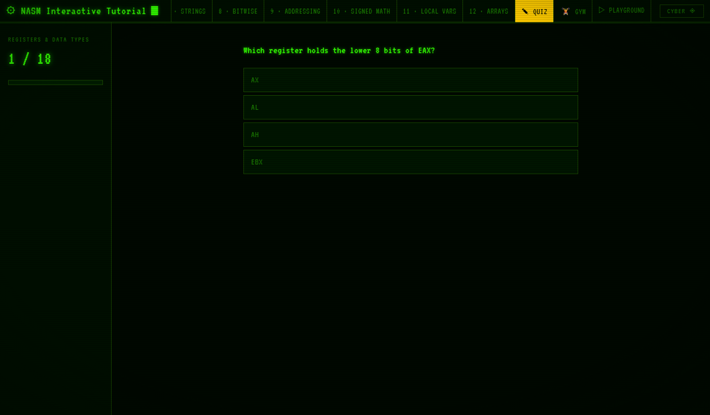
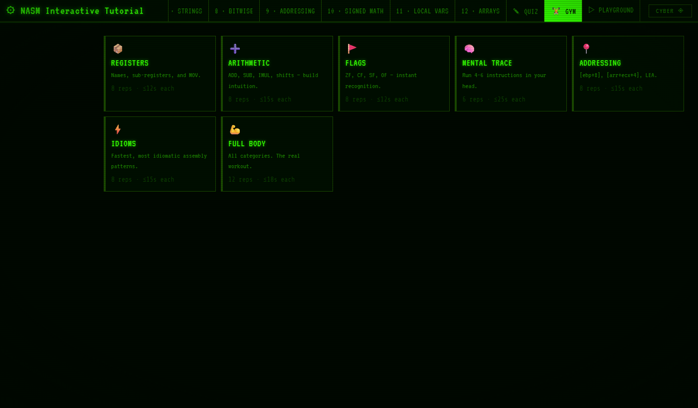
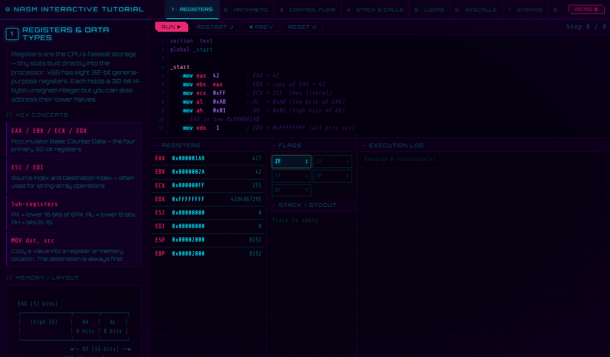
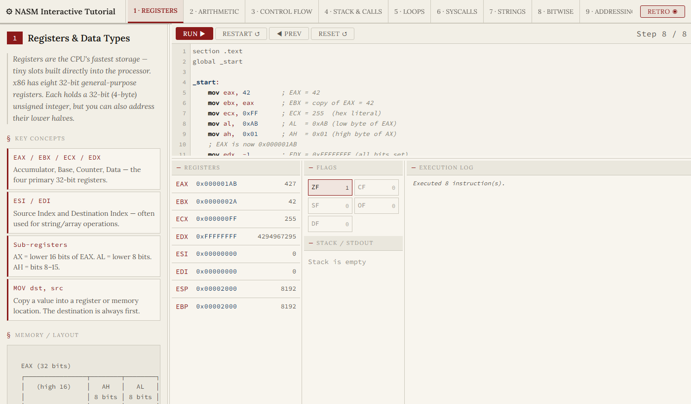

# NASM Learn

[](https://github.com/DavidTbilisi/nasm_learn/actions/workflows/test.yml)
[](https://github.com/DavidTbilisi/nasm_learn/actions/workflows/deploy.yml)
[](LICENSE)
[](https://davidtbilisi.github.io/nasm_learn/)

An interactive x86 assembly learning environment that runs entirely in the browser — no install required.

**[Live demo →](https://davidtbilisi.github.io/nasm_learn/)**

---



*Phosphor-green retro terminal — guided lesson with live register/flag/stack state*

---

## Who this is for

- **CS students** taking an Assembly Languages course who want a sandbox to play with examples between lectures.
- **Pentest learners** working through HTB / TryHackMe / OSCP prep who need to read disassembly fluently.
- **CTF players** on the pwn / reverse-engineering track who keep hitting the wall at stack frames and calling conventions.
- **Embedded systems / firmware developers** who read compiler output and want a faster mental model.
- **Retro-gaming / demoscene hobbyists** (NES, C64, Atari) who want a modern stepping debugger to prototype routines in.

## What you'll be able to do after the 12 lessons

- Read disassembled C output and follow the control flow.
- Set a breakpoint in real GDB+GEF on a Linux binary and step through it.
- Spot the endianness bug in a shellcode payload.
- Recognize a stack-frame prologue / epilogue at sight.
- Identify the SysV AMD64 calling convention in a disassembly.
- Predict register state through a chain of instructions without running the code.
- Write a small NASM program that prints to stdout via `syscall` on Linux.
- Sketch a buffer-overflow scenario on paper from memory.

## Demo



*Step through instructions one at a time — watch registers, flags, and the stack update live*

## How the tool gets you there

- **12 guided lessons** covering registers, arithmetic, flags, memory, the stack, loops, functions, strings, arrays, bitwise ops, and system calls.
- **Step-by-step debugger** — run, step forward/backward through instructions, see registers, flags, and stack update live.
- **Playground** — free-form editor to write and debug any assembly you like, with 6 built-in snippets and auto-save.
- **Quiz mode** — multiple-choice and type-in questions with instant feedback and a progress bar.
- **Gym mode** — timed drill workouts across 7 topic categories to build fluency under pressure.
- **3 themes** — Retro (phosphor green CRT), Cyberpunk (neon-noir), Academic (warm ivory, maximum readability).
- **Resizable panels** — drag handles to reflow the layout; double-click any handle to reset; persists via `localStorage`.
- **CodeMirror editor** with NASM syntax highlighting.

## Screenshots

### Debugger — step through instructions


### Playground — write freely, run anything



### Quiz mode



### Gym mode — timed drills



### Themes

| Cyberpunk | Academic |
|-----------|----------|
|  |  |

## Running locally

```bash
npx serve tutorial
```

## Simulator

The JavaScript simulator (`tutorial/simulator.js`) implements a subset of x86:

| Category | Instructions |
|---|---|
| Data movement | `mov`, `xchg`, `lea`, `push`, `pop` |
| Arithmetic | `add`, `sub`, `mul`, `imul`, `div`, `idiv`, `inc`, `dec`, `neg` |
| Logic | `and`, `or`, `xor`, `not`, `shl`, `shr`, `sar` |
| Comparison | `cmp`, `test` |
| Jumps | `jmp`, `je/jz`, `jne/jnz`, `jl/jnge`, `jle/jng`, `jg/jnle`, `jge/jnl`, `jb`, `jbe`, `ja`, `jae`, `js`, `jns` |
| Functions | `call`, `ret` |
| Output | `int 0x80` (Linux write/exit syscalls) |

Registers: `eax ebx ecx edx esi edi esp ebp`  
Flags: `ZF CF SF OF DF`

## Building NASM programs locally

### Windows (Win32 PE32) — `main.asm`

```powershell
nasm -f win32 main.asm -o main.o
ld main.o -o main -lkernel32
./main
```

### Linux (x86-64 ELF) — `examples/linux-hello.asm`

```bash
nasm -f elf64 examples/linux-hello.asm -o linux-hello.o
ld linux-hello.o -o linux-hello
./linux-hello
```

The Linux example calls the kernel directly — no libc — using `sys_write` (syscall 1) and `sys_exit` (syscall 60).

### macOS (x86-64 Mach-O) — `examples/macos-hello.asm`

```bash
nasm -f macho64 examples/macos-hello.asm -o macos-hello.o
ld -macos_version_min 10.13 -lSystem -o macos-hello macos-hello.o
./macos-hello
```

On macOS, syscall numbers are OR'd with the BSD class `0x2000000`, the entry point is `_main`, and `ld` needs `-lSystem` plus a minimum-version flag. Mach-O section names differ from ELF (e.g. `__TEXT`, `__DATA`) but NASM's `macho64` target handles the translation.

## Tests

[Playwright](https://playwright.dev/) end-to-end test suite — 54 tests covering page load, tab navigation, simulator run/step/reset, resize handles, quiz, and gym.

```bash
npm install
npx playwright install chromium
npm test
```

To run a single test by name:

```bash
npx playwright test --grep "error banner"
```

CI runs the full suite on every push and PR via [`.github/workflows/test.yml`](.github/workflows/test.yml).

## Part of the Neural OS Library

This repo is one of a family of small, focused learning resources:

- [memory-palace-lab](https://github.com/DavidTbilisi/memory-palace-lab) — the academy flagship
- [SorobanMachine](https://github.com/DavidTbilisi/SorobanMachine) — mental arithmetic drills
- [learn_linux](https://github.com/DavidTbilisi/davidtbilisi.learn_linux) — Linux fundamentals
- [learning_git](https://github.com/DavidTbilisi/davidtbilisi.learning_git) — Git from scratch
- [cheatsheets-ka](https://github.com/DavidTbilisi/cheatsheets-ka) — quick-reference handbook
- [IT-Dictionary](https://github.com/DavidTbilisi/IT-Dictionary) — terminology reference

## License

[ISC](LICENSE) — see the `LICENSE` file at the repo root.
